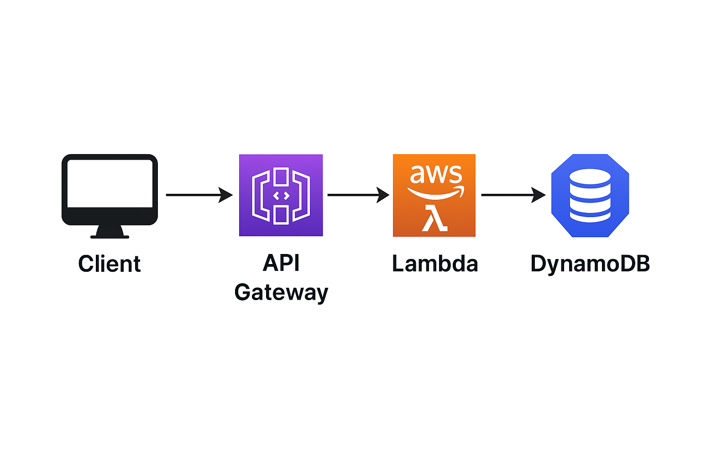

# AWS API Visitor Counter

[](https://aws.amazon.com/lambda/)
[](https://aws.amazon.com/dynamodb/)
[](https://aws.amazon.com/api-gateway/)
[](#)

This is a simple serverless visitor counter API built with AWS services...


# 🧮 AWS API Visitor Counter

This is a simple **serverless visitor counter API** built with AWS services.  
Each time the API is called, the number of visits is incremented and returned as a response.

> ✅ Built as a practical AWS hands-on training project.

---

## 🧱 Tech Stack

- **AWS Lambda** (Python)
- **Amazon API Gateway**
- **Amazon DynamoDB**
- **IAM Roles & Permissions**

---

## 📐 Architecture Overview

Client → API Gateway → Lambda → DynamoDB

- The Lambda function is triggered by API Gateway.
- The Lambda updates a `visitCount` in DynamoDB using `update_item()`.
- The updated count is returned as an HTTP response.

## 🖼️ Architecture Diagram



---

## 📁 Project Structure

```bash
aws-api-visitor-counter/
├── lambda_function.py
└── README.md
```

## 🚀 How to Deploy (Manual)
1. Create a DynamoDB table:

Table name: your choice (e.g., VisitorCounter)

Partition Key: id (String)

Initial item:
```bash
{
  "id": "visitor",
  "visitCount": 0
}
```

2.Create a Lambda function:

Runtime: Python 3.12 (or latest)

Handler: lambda_function.lambda_handler

Environment variable:
TABLE_NAME = your DynamoDB table name

Copy-paste the following code:
```bash
import boto3
import os

dynamodb = boto3.resource('dynamodb')
table_name = os.environ['TABLE_NAME']
table = dynamodb.Table(table_name)

def lambda_handler(event, context):
    response = table.update_item(
        Key={'id': 'visitor'},
        UpdateExpression='ADD visitCount :inc',
        ExpressionAttributeValues={':inc': 1},
        ReturnValues='UPDATED_NEW'
    )
    return {
        'statusCode': 200,
        'headers': {
            'Access-Control-Allow-Origin': '*'
        },
        'body': str(response['Attributes']['visitCount'])
    }
```

3. Create an API Gateway:

Type: HTTP API or REST API

Method: GET or POST

Integration: Lambda function

Enable CORS for frontend access

Deploy the API:

Save the endpoint URL for testing and frontend use

(Optional) Connect to a static frontend page
You can fetch the count using fetch() in HTML + JS and display it.

## 📄 Example Lambda Response
```bash
{
  "statusCode": 200,
  "headers": {
    "Access-Control-Allow-Origin": "*"
  },
  "body": "37"
}
```
## 🧪 Test the Live API

You can test the deployed visitor counter by visiting:

🔗 https://tpxq5sk2z1.execute-api.us-east-1.amazonaws.com/prod/updateVisitorCount
